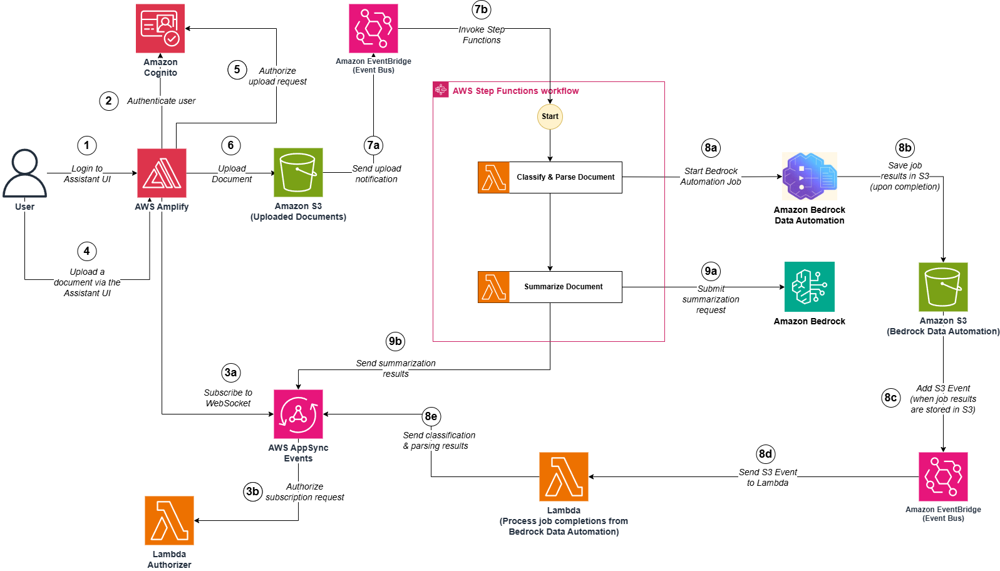

##  Create a real-time Intelligent document processing solution using AWS AppSync Events, AWS Step Functions and Amazon Bedrock Data Automation

This repository contains samples to provision an intelligent document processing solution with a web application used to upload documents for processing.

**Solution diagram**



You can follow the below pre-requisites and steps to deploy the solution in an AWS account.

**Pre-requisites**

To follow along and set up this solution, you must have the following:
* An AWS account
* A device with access to your AWS account with the following:
    * Python 3.12 installed
    * Node.js 20.12.0 installed
    * [The AWS Amplify CLI set up](http://docs.amplify.aws/react/start/manual-installation/)
* Setup Bedrock Data Automation by creating a project and set of blueprints following this [guide](https://docs.aws.amazon.com/bedrock/latest/userguide/bda-blueprints-console.html)

**Deployment steps**

Complete the following steps to provision the solution:

**Step 1**: Grant execution permissions for shell script files

```bash
echo "Enable execution on shell script files"
find . -name '*.sh' -exec chmod +x {} +
```

**Step 2**: Create S3 buckets to upload IdP documents and code files of Lambda functions

```bash
export CURRENT_DIR=$(pwd)
(cd $CURRENT_DIR/s3; ./create-idp-s3-bucket.sh)
(cd $CURRENT_DIR/s3; ./create-lambda-s3-bucket.sh)
(cd $CURRENT_DIR/s3; ./create-appsync-authlambda-s3-bucket.sh)
```

**Step 3**: Create Cognito user pool & identity pool (set the **EMAIL_ARG** variable to your email address)

```bash
# TODO: Set the EMAIL_ARG variable to your email address 
EMAIL_ARG="#replace-with-your-email-address#"
(cd $CURRENT_DIR/cognito; ./create-cognito-userpool.sh)
(cd $CURRENT_DIR/cognito; ./create-cognito-testuser.sh $EMAIL_ARG)
```

**Important note:** This step will also create a user in your user pool, you should receive an email with a temporary password in this format: "Your username is **#your-email-address#** and temporary password is **#temporary-password#**.". Keep note of your login details (email address and temporary password) as this will be used later when testing the web application.

**Step 4**: Package Lambda Authorizer function code

```bash
(cd $CURRENT_DIR/appsync/lambda-auth; ../package-lambda-auth.sh)
```

**Step 5**: Create AppSync Events API

```bash
(cd $CURRENT_DIR/appsync/; ./create-appsync.sh)
```

**Step 6**: Package Lambda functions (functions used in Step Functions state machine and function used for Bedrock Data Automation)

```bash
(cd $CURRENT_DIR/orchestration/lambda; ../package-lambda.sh)
(cd $CURRENT_DIR/orchestration/bda/lambda; ../package-bda-lambda.sh)
```

**Step 7**: Enable EventBridge notification on Bedrock Data Automation's S3 bucket (Set the **BDA_BUCKET_NAME** variable to your Bedrock Data Automation's S3 bucket name)

```bash
# TODO: Set the BDA_BUCKET_NAME variable to your Bedrock Data Automation's S3 bucket name
BDA_BUCKET_NAME="#replace-with-bda-s3-bucket-name"
aws s3api put-bucket-notification-configuration --bucket $BDA_BUCKET_NAME --notification-configuration='{ "EventBridgeConfiguration": {} }'
```

**Step 8**: Create Step Functions state machine and Lambda functions

```bash
(cd $CURRENT_DIR/orchestration/bda; ./create-bda-lambda.sh $BDA_BUCKET_NAME)
(cd $CURRENT_DIR/orchestration/; ./create-state-machine.sh)
```

**Step 9**: Setup Amplify to deploy the web application

```bash
(cd $CURRENT_DIR/amplify/; ./create-amplify-project.sh)
(cd $CURRENT_DIR/amplify/; ./create-amplify-app.sh)
(cd $CURRENT_DIR/s3; ./create-amplifyapp-s3-bucket.sh)
```

**Step 10**: Deploy the web application

```bash
(cd $CURRENT_DIR/amplify/amplify-idp; ./deploy.sh)
```

Once the solution is deployed:
* Open the AWS Amplify App **URL** in your navigator
* Login with your **email address** and **temporary password** (you should have recorded these details in **Step 3**)
* Once done, when prompted, enter a **new password** and choose **Change Password**
* You should now be able to see a **chat interface**, to **upload a document** (or **capture a picture** from your camera)
* Once done, you should see a **summary** of the document along with a **classification** and **specific fields extracted**

## Security

See [CONTRIBUTING](CONTRIBUTING.md#security-issue-notifications) for more information.

## License

This library is licensed under the MIT-0 License. See the LICENSE file.

